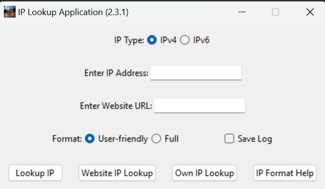

# IP Lookup Application

This program enables users to perform IP address lookups and retrieve information about IP addresses or websites. It offers options to choose between IPv4 and IPv6 addresses, select user-friendly or full format for the results, and perform lookups for IP addresses and website URLs. Additionally, it features caching of lookup results and the option to save logs.

For more information about IP addresses, please refer to the [IP Address Wikipedia page](https://en.wikipedia.org/wiki/IP_address).

## Features
- Perform IP address lookups for both IPv4 and IPv6 addresses.
- Retrieve information about a website's IP address.
- Display IP information in either a user-friendly or full format.
- Capability to check the user's own IP address.
- Option to view help documentation about IP addresses.
- Caching: Lookup results are cached to improve performance.
- Log Saving: Option to save cache logs.

#### As of v2.4.0
- An about menu with options for checking for updates using the GitHub API.
- A button linking to the repository for public contributions.
- Other details such as version information and a reference to ip-api.com.
- Potentially more in future.

### PIP Dependencies (To install, open cmd and type `pip install <package-name>`)
- `public_ip`: Library to retrieve the user's public IP address. [GitHub Link](https://github.com/vterron/public-ip)
- `requests`: HTTP library for making requests. [GitHub Link](https://github.com/psf/requests)
- `atexit`: Used in this script to save the log on exit if conditions are met. [GitHub Link](https://github.com/python/cpython/blob/main/Modules%2Fatexitmodule.c)

### Usage

1. Select the IP type (IPv4 or IPv6).
2. Enter the IP address or website URL.
3. Choose the desired format for the results.
4. Click on the corresponding button:
    - **Lookup IP**: Perform IP lookup based on the selected IP type and entered IP address.
    - **Website IP Lookup**: Perform IP lookup for a given website URL.
    - **Own IP Lookup**: Check your own IP address.
    - **IP Format Help**: View help documentation about IP addresses.

## API Usage
This application relies on the [ip-api.com](http://ip-api.com) API to retrieve information about IP addresses. Please note the following:
- **Acceptable Use Policy**: The use of the API is strictly limited for non-commercial purposes and in non-commercial environments. Please ensure compliance with ip-api.com's [Acceptable Use Policy](https://ip-api.com/docs/legal#acceptable-use).
- **Privacy Policy**: For anonymous, unauthenticated users of ip-api.com, their [Privacy Policy](https://ip-api.com/docs/legal#privacy-policy) applies. They do not track or analyse access to the website, and no cookies are placed on the user's computer during the usage of the website.
- **Usage Limits**: The API has usage limits, with a maximum of 45 requests per minute. If this limit is exceeded, access to the API will be temporarily blocked, and repeated violations may result in IP address bans. Please refer to ip-api.com's [Usage Limits](https://ip-api.com/docs/legal#usage-limits) for more information.
- **Data Accuracy**: While ip-api.com strives to provide accurate data, there may be errors or inaccuracies in the information returned by the API. Please be aware of this when using the data for my application.
- **Contact**: If you have any questions or concerns about ip-api.com, their services, or privacy policies, you can contact them at contact@ip-api.com.

## Executable Version

An executable version of the application, created with PyInstaller, is available for users who prefer not to run the Python script directly or do not have Python installed on their system. You can download the installer file from the following link:

[Download IP Lookup Application (Executable)](exe_version/)

## PyInstaller
For more information about PyInstaller, please visit the [PyInstaller GitHub repository](https://github.com/pyinstaller/pyinstaller).

## License
This project is licensed under the MIT License. See the [LICENSE](LICENSE) file for details. If there are errors in licensing (to do with the API) please let me know.
