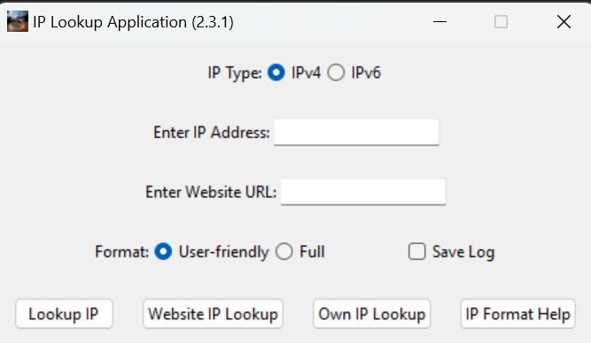

# IP Lookup Application

This program allows users to perform IP address lookups and retrieve information about IP addresses or websites. It provides options to select between IPv4 and IPv6 addresses, choose between user-friendly or full format for the results, and performs lookups for IP addresses and website URLs. Additionally, it features caching of lookup results and the option to save logs.

For more information about IP addresses, please refer to the [IP Address Wikipedia page](https://en.wikipedia.org/wiki/IP_address).

## Features
- Perform IP address lookups for both IPv4 and IPv6 addresses.
- Retrieve information about a website's IP address.
- Display IP information in either a user-friendly or full format.
- Capability to check the user's own IP address.
- Option to view help documentation about IP addresses.

#### As of v2.2.2:
- Caching: Lookup results are cached to improve performance.
- Log Saving: Option to save logs.

## Dependencies
- `tkinter`: Python's standard GUI (Graphical User Interface) toolkit.
- `threading`: Allows multithreading.
- `webbrowser`: Opens URLs in the user's default web browser.
- `public_ip`: Library to retrieve the user's public IP address.
- `requests`: HTTP library for making requests.
- `ipaddress`: Library for working with IP addresses.
- `appdirs`: Library for determining appropriate locations for user data.
- `atexit`: Allows registration of cleanup functions.
- `json`: Library for encoding and decoding JSON data.
- `time`: Provides various time-related functions.
- `socket`: Provides access to the BSD socket interface.
- `os`: Provides functions for interacting with the operating system.

## Usage

1. Select the IP type (IPv4 or IPv6).
2. Enter the IP address or website URL.
3. Choose the desired format for the results.
4. Click on the corresponding button:
    - **Lookup IP**: Perform IP lookup based on the selected IP type and entered IP address.
    - **Website IP Lookup**: Perform IP lookup for a given website URL.
    - **Own IP Lookup**: Check your own IP address.
    - **IP Format Help**: View help documentation about IP addresses.

## API Usage
This application relies on the [ip-api.com](http://ip-api.com) API to retrieve information about IP addresses. Please note the following:
- **API Limitations**: The usage of the API may be subject to rate limits or other restrictions imposed by ip-api.com. Please refer to their documentation for more details.
- **Internet Connection**: An active internet connection is required for the application to access the API and retrieve IP information.

## Executable Version

An executable version of the application, created with PyInstaller, is available for users who prefer not to run the Python script directly. You can download the zip file from the following link:

[Download IP Lookup Application (Executable)](exe_version/)

After downloading, extract the contents of the zip file and run the executable file to use the application.

## PyInstaller
For more information about PyInstaller please visit the [PyInstaller GitHub repository](https://github.com/pyinstaller/pyinstaller).
